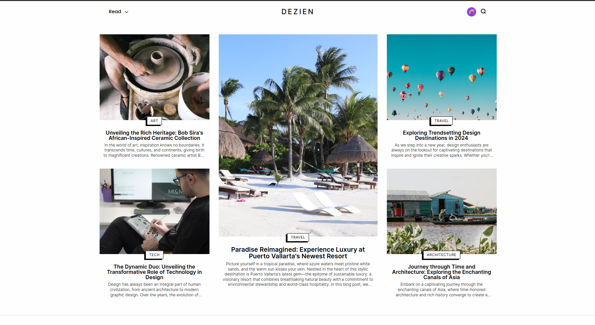
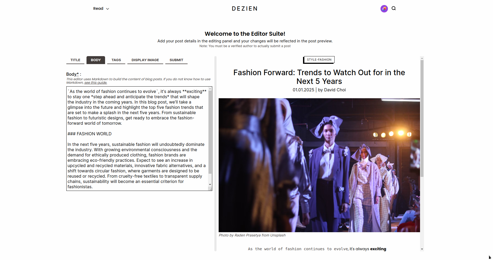
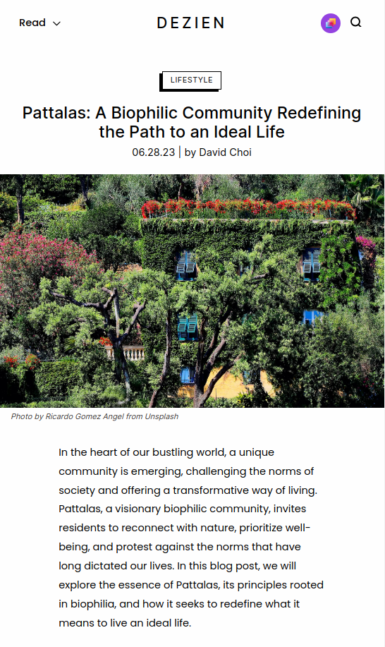

# Project: Dezien Blog

[The **live version** of the app can be found here](https://dezien-blog.vercel.app/)

[The repository for this blog's **API/backend** can be found here](https://github.com/renchester/blog-api)

---

This repository comprises the frontend portion of the Dezien Blog App. This blog is centered around design, architecture, travel, and technology. The app is built with NextJS/React and Typescript, with Sass for styling.

## Key Features

1. **Persistent Authentication using JWTs**: The app integrates with the backend auth server to issue refresh tokens on login, which are stored in an HTTPOnly cookie on the browser. The refresh tokens are used to reissue short-lived access tokens which are used to persist user login information in the app. These access tokens are stored in app memory and are automatically refreshed using Axios interceptors.

1. **Intuitive User Interface**: The frontend is designed to be intuitive, ensuring that users can effortlessly navigate through various sections of the blog app. The clean and well-organized layout makes it easy to discover and access different articles, categories, and tags.

1. **Engaging Content Presentation**: As a design blog, understanding the importance of visually appealing content is key for the end-user experience. The frontend ensures that articles, images, and multimedia elements are displayed in an engaging and aesthetically pleasing manner. This enhances the overall reading experience and captivates the attention of the audience.

1. **Responsive Design**: Our blog app is built with a responsive design, ensuring that it adapts seamlessly to different screen sizes and devices. The blog can be accessed on a desktop, laptop, tablet, or a smartphone, while ensuring that users can enjoy the same level of functionality and visual appeal across all platforms.

1. **Integration with Backend/API**: The frontend seamlessly integrates with the backend of our full-stack blog app--enabling real-time updates, instant publishing of new articles, and efficient retrieval of content. This integration ensures that readers always have access to the most recent and relevant information.

1. **Editor Suite**: The app features an [editor suite](https://dezien-blog.vercel.app/create), which allows users to edit and preview their blog posts in real-time. The editor to handle blog content uses [React Markdown](https://github.com/remarkjs/react-markdown) to instantly transform markdown into React elements. _Note: While everyone is allowed to use the editor suite, only verified authors can submit posts to the database._

1. **Dynamic Blog Content**: With the editor suite, blog content can use code blocks, emphasized/bold characters, headings, images, and hyperlinks. This allows a richer experience instead of just having plain text for blog posts.

## Technologies Used

- Typescript
- NextJS/React
- Sass
- JWTs
- Axios

## Credits/Acknowledgments

This project is for personal use only. All blog content text have been generated using ChatGPT. Images used in the blog posts are retrieved from Unsplash.

## Display

_Home Page - Hero_

_Editor Suite - Blog Content Tab_

_Post Preview - Mobile_

---

Developed by **Renchester Ramos**
